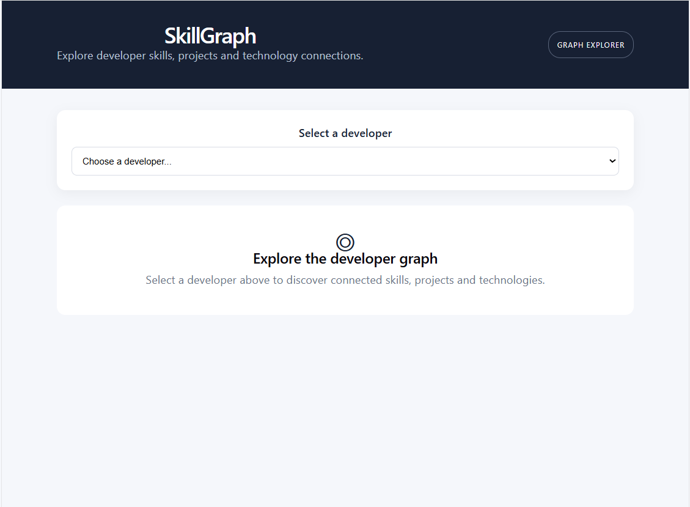
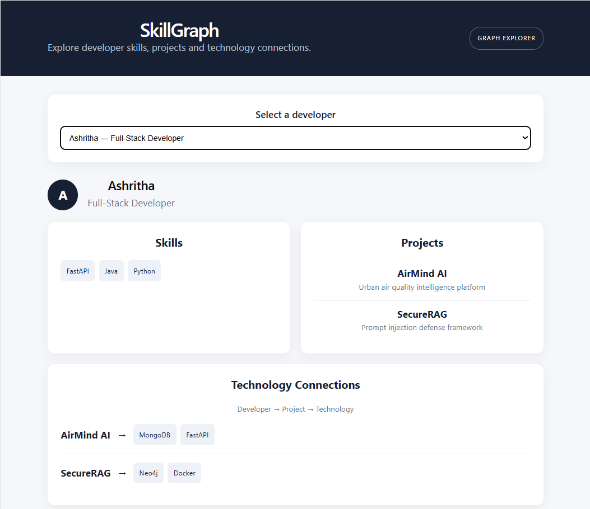

# SkillGraph

### Graph-Based Developer Skill & Project Explorer

SkillGraph is a full-stack web application that uses a graph database to explore relationships between developers, their skills, projects, and technologies.

Instead of viewing developers as isolated records, SkillGraph allows users to navigate the connections between these entities.

## Live Demo

https://skillgraph-pi.vercel.app/

## Architecture

```text
React + Vite
     |
     v
FastAPI REST API
     |
     v
Neo4j Python Driver
     |
     v
CognoDB Graph Database
```

## Why a Graph Database?

The core of SkillGraph is based on relationships.

A developer can have multiple skills, work on multiple projects, and each project can use multiple technologies. Skills can also be associated with projects.

This creates connected paths such as:

```text
Developer
    ↓
Skill
    ↓
Project
    ↓
Technology
```

A relational database could represent these entities using multiple tables and JOIN operations. However, as the number of relationships grows, queries involving multiple levels of connections become increasingly dependent on JOINs.

A graph database represents these relationships directly as nodes and relationships, making traversal-based queries natural and easier to express using Cypher.

For SkillGraph, the graph model therefore provides a natural representation of the domain and makes multi-hop relationship exploration straightforward.

## Graph Data Model

```text
(:Developer)
     |
     | HAS_SKILL
     v
(:Skill)
     |
     | USED_IN
     v
(:Project)
     |
     | USES
     v
(:Technology)

(:Developer)
     |
     | WORKED_ON
     v
(:Project)
```

### Nodes

| Node       | Properties        |
| ---------- | ----------------- |
| Developer  | name, role        |
| Skill      | name              |
| Project    | name, description |
| Technology | name              |

### Relationships

| Relationship | Meaning                          |
| ------------ | -------------------------------- |
| HAS_SKILL    | Developer has a particular skill |
| WORKED_ON    | Developer worked on a project    |
| USED_IN      | Skill is used in a project       |
| USES         | Project uses a technology        |

## Example Graph

```text
Ashritha
   |
   +-- HAS_SKILL --> Python
   |                    |
   |                    +-- USED_IN --> AirMind AI
   |
   +-- HAS_SKILL --> FastAPI
   |                    |
   |                    +-- USED_IN --> AirMind AI
   |
   +-- WORKED_ON --> AirMind AI
                         |
                         +-- USES --> MongoDB
                         |
                         +-- USES --> FastAPI

Ashritha
   |
   +-- WORKED_ON --> SecureRAG
                         |
                         +-- USES --> Neo4j
                         |
                         +-- USES --> Docker
```

## Key Graph Queries

### 1. Find a developer's skills

```cypher
MATCH (d:Developer {name: $name})
      -[:HAS_SKILL]->(s:Skill)
RETURN s.name AS name
ORDER BY s.name
```

The developer name is supplied as a parameter through the Neo4j driver.

### 2. Find a developer's projects

```cypher
MATCH (d:Developer {name: $name})
      -[:WORKED_ON]->(p:Project)
RETURN p.name AS name,
       p.description AS description
ORDER BY p.name
```

### 3. Multi-hop traversal

```cypher
MATCH (d:Developer {name: $name})
      -[:WORKED_ON]->(p:Project)
      -[:USES]->(t:Technology)
RETURN p.name AS project,
       collect(t.name) AS technologies
ORDER BY p.name
```

This traverses two relationships:

```text
Developer → Project → Technology
```

This is one of the main reasons a graph database is useful for this application.

## Data

The repository contains a seed script that creates realistic sample data including:

* Developers
* Skills
* Projects
* Technologies
* Developer-to-skill relationships
* Developer-to-project relationships
* Skill-to-project relationships
* Project-to-technology relationships

Run the seed script with:

```bash
cd backend
python seed.py
```

## Project Structure

```text
skillgraph/
│
├── backend/
│   ├── main.py
│   ├── seed.py
│   ├── test_connection.py
│   ├── requirements.txt
│   ├── .env
│   └── .gitignore
│
├── frontend/
│   ├── src/
│   │   ├── App.jsx
│   │   ├── App.css
│   │   └── main.jsx
│   ├── package.json
│   └── vite.config.js
│
└── README.md
```

## Backend Setup

### 1. Clone the repository

```bash
git clone https://github.com/ashrithakadarla/skillgraph.git
cd skillgraph
```

### 2. Create a Python virtual environment

```bash
cd backend
python -m venv venv
```

Activate it on Windows:

```bash
venv\Scripts\activate
```

### 3. Install dependencies

```bash
pip install -r requirements.txt
```

### 4. Configure environment variables

Create a `.env` file:

```env
COGNODB_URI=your_cognodb_uri
COGNODB_USER=cognodb
COGNODB_PASSWORD=your_cognodb_password
```

Credentials must be stored in environment variables and should never be committed to the repository.

### 5. Seed the database

```bash
python seed.py
```

### 6. Start the API

```bash
uvicorn main:app --reload
```

The API will be available at:

```text
http://127.0.0.1:8000
```

Interactive API documentation is available at:

```text
http://127.0.0.1:8000/docs
```

## Frontend Setup

Open another terminal:

```bash
cd frontend
npm install
npm run dev
```

The Vite development server will provide the local frontend URL.

## Application Features

* Developer selection
* Developer profile information
* Skill exploration
* Project exploration
* Multi-hop technology connections
* Loading state
* Empty state
* Database/API error handling
* Responsive interface

## Deployment

The application is deployed using:

* **Frontend:** Vercel
* **Backend:** Render
* **Database:** CognoDB

Live application:

https://skillgraph-pi.vercel.app/

## Screenshots

### Developer Explorer



### Developer Connections



## Future Improvements

Possible extensions include:

* Interactive graph visualization
* Skill recommendations
* Developer similarity search
* Project recommendation based on skills
* More detailed graph analytics
* Authentication and personalized developer profiles

## Author

**Ashritha Kadarla**

Built as a take-home assignment for the Software Engineer (Full-Stack / Web Developer) position at Wexa AI.
